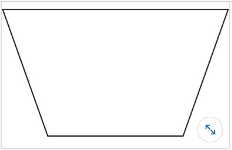
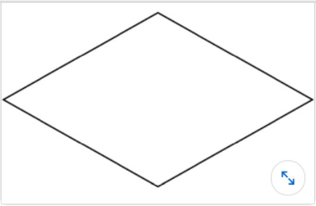
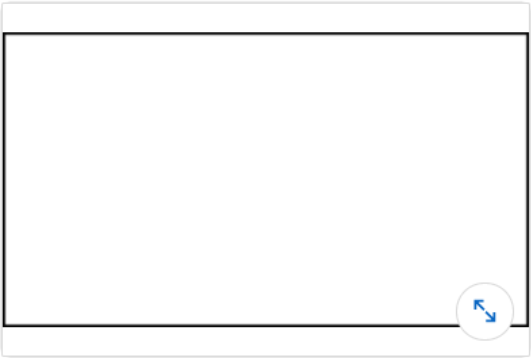
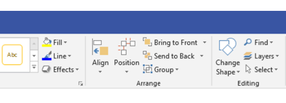

## Visio

#### Q1. You've created a timeline by using the Timeline template in the Schedule template category. You've just learned that project has been extended by another month. How do you change the end date on the timeline?

- [ ] Double-click the timeline, change the Finish date, and then click OK.
- [ ] Select the timeline shape, then drag the control handle on the right end of the timeline to the right.
- [ ] Re-create the timeline using the updated finish date.
- [x] Right-click the timeline, select Configure Timeline, change the Finish date, and then click OK.

#### Q2. What is the correct order of the three basic steps required to create nearly all diagrams?

- [x] A

```markdown
1. Create a new diagram from one of the templates.
2. Drag shapes onto the page.
3. Add text to shapes (if required).
```

- [ ] B

```markdown
1. Open a starter diagram.
2. Drag shapes around.
3. Connect the shapes and add text.
```

- [ ] C

```markdown
1. Create a new diagram from one of the templates.
2. Create shapes using the drawing tools.
3. Add text to shapes (if required).
```

- [ ] D

```markdown
1. Open a starter diagram.
2. Add text to shapes (if required).
3. Drag shapes onto the page.
```

#### Q3. What is the difference between the **Drawing** tools in the **Tools** group on the **Home** tab and the **Drawing** tools on the **Mini Toolbar**?

- [ ] The tools on the Mini Toolbar draw shapes with red borders.
- [ ] The tools on the Home tab automatically revert to the Pointer tool after drawing one shape.
- [ ] The tools on the Home tab draw shapes with dashed-line borders.
- [x] The tools on the Mini Toolbar automatically revert to the Pointer tool after drawing one shape.

#### Q4. Which of these is _not_ one of the standard data sources that is available when running the **Data Selector Wizard**?

- [x] Microsoft Outlook tasks list
- [ ] Microsoft Access database
- [ ] Microsoft SQL Server database
- [ ] Microsoft SharePoint Foundation list

#### Q5. A rack diagram is an example of a \_\_\_, one in which the size of the shapes on the page is dependent on the size and scale of the page itself.

- [x] two-dimensional drawing
- [ ] units drawing
- [ ] metric drawing
- [ ] scaled drawing

#### Q6. What do you call the spreadsheet-like data store that exists behind every object in Visio?

- [x] ShapeSheet
- [ ] variable list
- [ ] workspace
- [ ] Master

#### Q7. You've created a one-page organization chart but would like to remove the picture placeholders from all of the org chart shapes. How do you do it?

- [x] Select all shapes on the page, then on the Org Chart tab, in the Picture group, click Show/Hide.
- [ ] Ensure that no shapes are selected, then on the Org Chart tab, in the Picture group, click Show/Hide.
- [ ] Select the Executive shape, then on the Org Chart tab, in the Picture group, click Show/Hide.
- [ ] Right-click the Executive shape, select Picture, and then select Hide.

#### Q8. What is a connector in Visio?

- [ ] a visual boundary around sets of objects that also builds logical relationships
- [ ] a container that maintains an ordered relationship among its members
- [ ] a shape that is glued to others to add comments
- [x] a one-dimensional shape that is used to connect two shapes

#### Q9. Which flowchart shape indicates a question or branch in the process flow?

- [ ] A



- [x] B



- [ ] C


- [ ] D



#### Q10. Some Business Process Model Notation (BPMN) shapes are further annotated by attaching a callout shape. Which option is associated with a callout shape?

- [ ] Message Flow
- [ ] Association
- [ ] Data Object
- [x] Text Annotation

#### Q11. When a shape is rotated in Visio, what does it rotate around?

- [ ] the center of the page
- [x] the shape's pin position
- [ ] the shape's center of gravity
- [ ] the origin on the rulers

#### Q12. Which is one of the template categories in the Visio Standard desktop app?

- [ ] Engineering
- [x] Software and Database
- [ ] Maps and Floor Plans
- [ ] Science

#### Q13. What does the icon in the lower-right corner of the organizational shape indicate?


- [ ] Belt shape
- [x] hidden subordinates
- [ ] synchronized copy
- [ ] executive position

#### Q14. You need to create a diagram showing many servers, switches, and other devices in a large corporate environment. Which diagram should you use?

- [x] detailed network diagram
- [ ] rack diagram
- [ ] baseline
- [ ] wiring schematic

#### Q15. You added a container with no exclusions to a page. It looks like shapes are in the container, but when you move the container, the shapes do not move. How do you give the container and shapes a specific relationship?

- [ ] Use the Container Tools Format tab and under Membership, use Select Contents to add the shapes.
- [ ] Center the container over the top of the shapes.
- [x] Select all the shapes to be added, right-click, and select Container \> Add to Underlying Container.
- [ ] Select the container and use the commands in the Format tab to add the shapes.

#### Q16. Which of these defines the relative front-to-back position of the shape of a drawing?

- [ ] layer
- [x] z-order
- [ ] x-coordinate
- [ ] y-coordinate

#### Q17. On a Visio organization chart, which is _not_ one of the standard shapes?

- [ ] manager
- [ ] executive
- [ ] associate
- [x] assistant

#### Q18. You need to save a Visio drawing that contains a VBA macro. Which file format do you use?

- [ ] .vsdm
- [ ] .vstx
- [ ] .vssx
- [x] .vsdx

#### Q19. If you want to move a shape using the mouse, which key should you hold down so that the movement is restricted to being only horizontal or vertical?

- [ ] Alt
- [ ] Ctrl
- [ ] Tab
- [x] Shift

#### Q20. How do you constrain the Rectangle and Ellipse tools so they draw only squares or circles?

- [x] Hold down the Shift key while dragging the selection handle.
- [ ] Hold down the Ctrl key while dragging the selection handle.
- [ ] Hold down the Tab key while dragging the selection handle.
- [ ] Hold down the Shift key while dragging the selection handle.

#### Q21. How do you view a Visio diagram in full-screen view, i.e., with no ribbon or windows?

- [ ] Press Shift+F7.
- [ ] Press Shift+F5.
- [ ] Press F7.
- [x] Press F5.

#### Q22. Which report would you run to provide equipment shape text, network name, network description, building, room, and asset number?

- [x] Network Equipment
- [ ] Network Device
- [ ] PC Report
- [ ] Inventory

#### Q23. You are inserting a hyperlink from one shape in a Visio drawing to another shape. Which of these attributes of the target shape must you specify as part of the hyperlink?

- [ ] Z-Order
- [x] Type
- [ ] Name
- [ ] Master

#### Q24. Management asked you to build an organization chart showing each employee's hire date and years of service separately from the shape data. Which data graphic should you use to show this data?

- [ ] insertion bar
- [x] data bar
- [ ] text callout
- [ ] icon set

#### Q25. Which of these options is available when you select some shapes and then click the arrow on the Position button in the Arrange group on the Home tab?



- [x] Auto Align
- [ ] Auto Space
- [ ] Align Center
- [ ] Align Right

#### Q26. Why would you use an icon set in your drawing?

- [ ] to simply show data in the form of text, or to show text plus other symbols related to data, such as currency symbols
- [x] to show conditions; to visualize data in grouped percentages, amounts, or degrees; and simply to represent data in yes-or-no format
- [ ] to show percentages, ratings, progressions, scores, and amounts for comparing symbols and identifying symbol performance
- [ ] to fill shapes with color according to their data, such as identifying all shapes of a color as "on" and different colored shapes as "off"

#### Q27. Which is _not_ a way to disable AutoConnect with the Quick Shapes menu?

- [ ] On the View tab, in the Visual Aids group, clear the AutoConnect check box.
- [ ] On the File tab, open the Options dialog. In the Advanced group, clear Enable AutoConnect.
- [ ] In the Quick Shapes menu, select a connector or container shape first. This way, no shapes will appear on the Quick Shapes menu.
- [x] Open the Document Stencil and move all shapes out of the "Drop Quick Shapes here" area.

#### Q28. How do you add a foreground page immediately after the current foreground page?

- [ ] From the Insert tab, in the Pages group, click the New Page button.
- [ ] Right-click the page name tab, click Page Setup, enter a new name in the Name box, and select Foreground.
- [x] Right-click the page name tab, click Insert, and on the Page Properties tab, select Foreground.
- [ ] From the Insert tab, in the Pages group, click the New Page arrow and select Blank Page.

#### Q29. Which is _not_ one of the standard options for reducing the file size of a drawing?

- [ ] remove preview picture
- [x] compress shape data
- [ ] remove unused themes, data graphics, and styles
- [ ] remove unused master shapes

#### Q30. How do you move among multiple documents when you have them all open in the same instance of Visio?

- [x] Press Ctrl+F6.
- [ ] Press Shift+F6.
- [ ] Press Ctrl+Shift+F6.
- [ ] On the View tab, in the Window group, click the Next Window button.

#### Q31. You have dragged a table shape from the Office Furniture stencil into an office layout diagram, but it is not the correct width. Which method can you _not_ use to set the width of the table?

- [x] A

```markdown
1. Select the table shape.
2. In the Size & Position window, type the desired width value into the Width field.
```

- [ ] B

```markdown
1. Select the table shape.
2. In the Shape Data window, type the desired width value into the Width field.
```

- [ ] C

```markdown
1. Select the table shape.
2. In the Size & Position window, type the desired width value into the X field.
```

- [ ] D

```markdown
1. Ensure that the Shape Data window is open.
2. Select the table shape.
3. Click and drag one of the shape's selection handles until the Width field displays the desired value.
```

#### Q32. What key combination do you use to return to viewing the whole page in Visio?

- [ ] Ctrl+Home
- [ ] Ctrl+W
- [x] Ctrl+Shift+W
- [ ] Esc

#### Q33. What is the unique feature of rack equipment shapes that would lead you to think that the rack and the equipment shape have active connections points?

- [x] They look like 2D shapes, yet behave like lines, dynamic connectors, and other one-dimensional shapes.
- [ ] They look like 3D shapes, yet behave like lines, dynamic connectors, and other two-dimensional shapes.
- [ ] They look like 2D shapes, yet behave like lines, dynamic connectors, and other three-dimensional shapes.
- [ ] They look like 3D shapes, yet behave like lines, dynamic connectors, and other one-dimensional shapes.

#### Q34. Which file format does not give you the choice of saving a subset of your drawing pages into the format you want?

- [ ] .html
- [x] .dwg
- [ ] .xps
- [ ] .pdf
